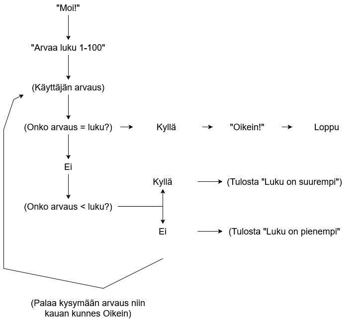

# Arvauspeli
Ryhmän jäsenet: Elias Nieminen, Jesse Mitronen & Jere Paussu

## Demo-linkki:
Tähän linkki

## Työmäärän jakautuminen
Kaikki tekivät yhdessä koodia...

## Sisällysluottelo:

- [Tietoa sovelluksesta](#tietoa-sovelluksesta)
- [Kuvankaappaukset](#Kuvankaappaukset)
- [Teknologiat](#Teknologiat)
- [Suunnittelu / Vuokaavio](#Suunnittelu)
- [Tila](#Tila)
- [Lähteet ja tekijät](#lähteet-ja-tekijät)
- [Lisenssi](#lisenssi)

## Tietoa sovelluksesta
Arvauspeli on sovellus, joka...

## Kuvankaappaukset
Tähän vähintään yks kuvankaappaus sovelluksesta.

## Teknologiat
Projektissa käytettiin pythonia

## Suunnittelu
Meidän ryhmä lähestyi tehtävää ensin keskustelemalla siitä, millainen sovellus olisi sopivan haastava mutta silti toteutettavissa. Halusimme tehdä jotain missä on selkeä logiikka ja käyttäisi silmukoita. Päädyimme arvauspeliin, koska se sisältää paljon kurssilla oppimaamme, eikä ole liian monimutkainen. 

Suunnitellimme ensin sovelluksen toiminnan vaihe vaiheelta: ohjelma arpoo luvun, käyttäjä arvaa, ja ohjelma antaa palautteen siitä, onko arvaus liian suuri tai pieni.

Tämän jälkeen teimme vuokaavion, jotta sovelluksen toiminta olisi helpompi hahmottaa, minkä jälkeen aloitimme yhdessä koodin toteutuksen.

## Tila
Arvauspeli on vielä työn alla. 'Versio 2' julkaistaan pian.

## Lähteet ja tekijät
Tekijät: Elias Nieminen, Jesse Mitronen & Jere Paussu
Käytimme W3Schools nettisivua, että saimme "random modulen" toimimaan.

## Lisenssi
MIT-lisenssi © [tekijä](mit-license.org)
